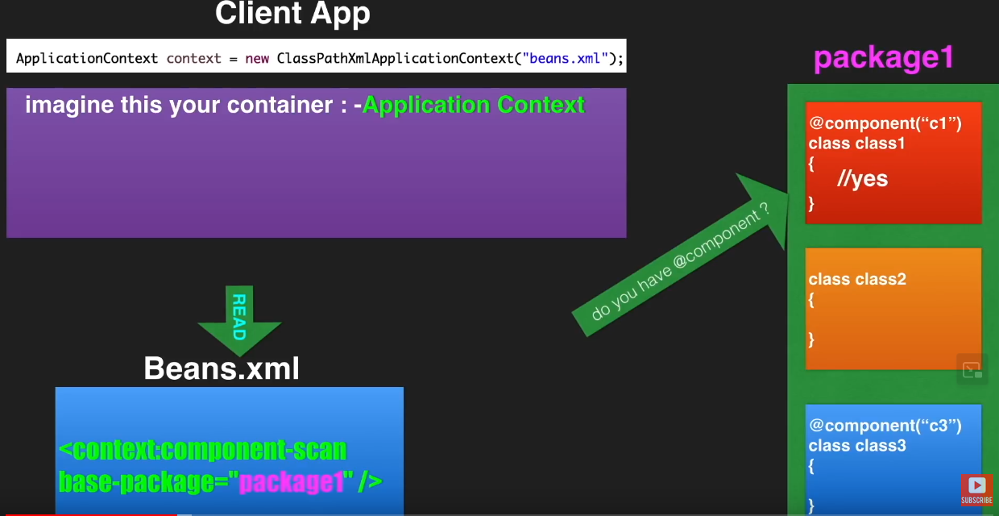

In this demo, we will learn;
    Other spring core annotation
    Don't use XML configuration, instead config from java side. 

 refer for visual representation 

## Step to use @Annotation configuration rather xml based config
    
    Create configuration class with annotation @Configuration & use @ComponentScan
    Create Spring container uing AnnotationConfigApplicationContext rather using XMLConfiguration

## Way to create bean?
     using <bean> tag  in the XML config file
     Java side,
         mark class with @Component ( @Componentscan is required )
                or
         mark method @Bean which returns bean in configuration class ( @Componentscan not required )